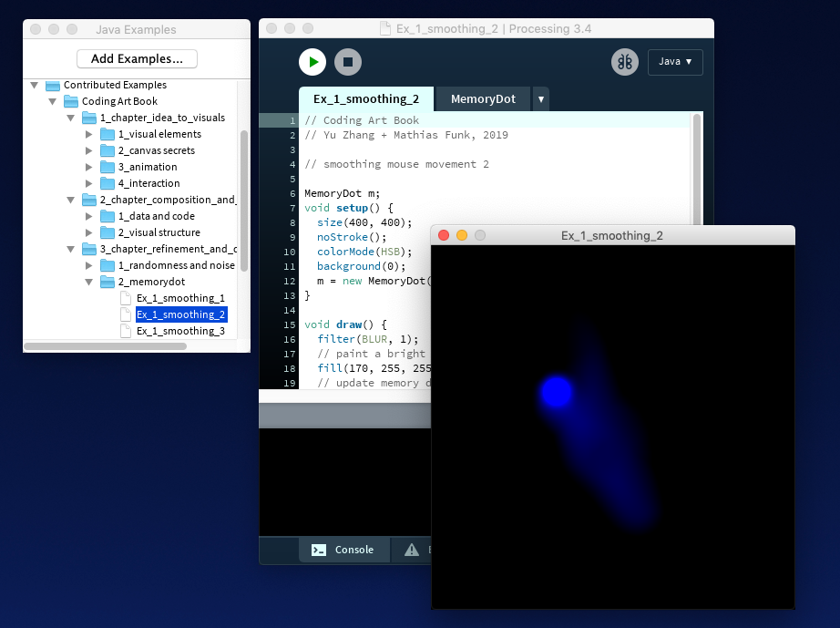
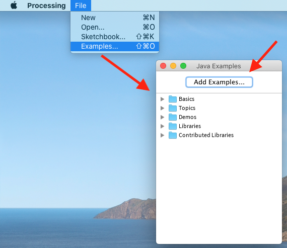
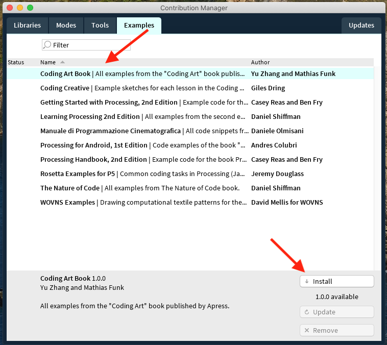
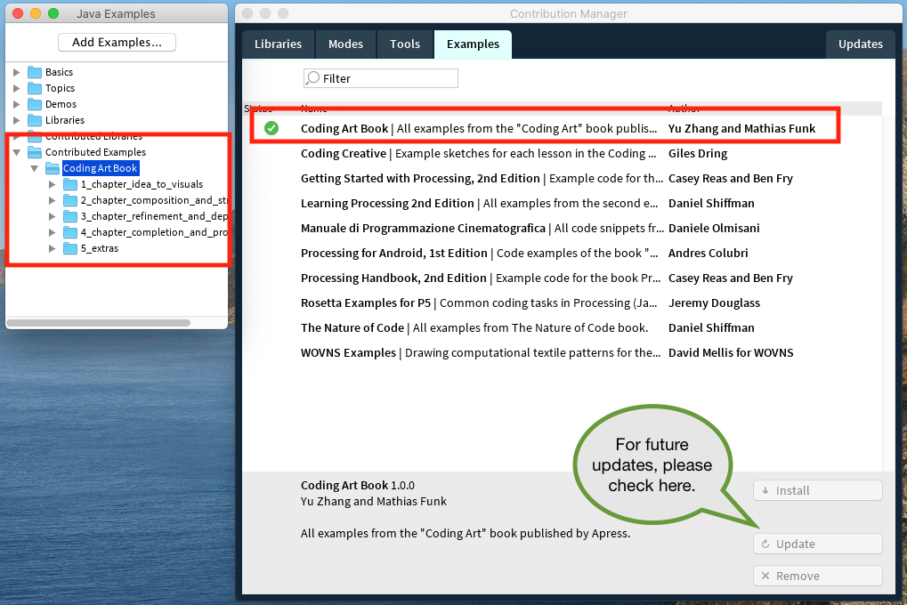

# Coding Art

This is the repository for all source code examples in the "Coding Art" book. We publish the code of all examples in the book organized by chapter and section.

This content will also be available as a Processing example library soon.

You can browse the examples by chapter here:

* Chapter [Idea to visuals](/examples/1_chapter_idea_to_visuals)
* Chapter [Composition and structure](/examples/2_chapter_composition_and_structure)
* Chapter [Refinement and depth](/examples/3_chapter_refinement_and_depth)
* Chapter [Completion and production](/examples/4_chapter_completion_and_production)
* Extras: [Miscellaneous code examples](/examples/5_extras)

## How to easy-install the library

Open Processing and the Examples box (File >> Examples...). In the examples box, click the button "Add examples..." at the top and enter "Coding Art" in the search box. Click the example in the results and install it. Done.

Here is the picture-perfect walk-through on macOS (Windows and Linux should work in a similar way):

## How to manually install the library

Download the [library archive](https://codingart-book.github.io/examples/CodingArtBookExamples.zip) and unpack it into the Processing examples folder on your computer. This folder is usually located in your home directory and contains subfolders such as examples, libraries, tools etc.

__Quick check:__ After this step, your Processing libraries folder should include a new folder "CodingArtBookExamples", which contains three files and the "examples" folder. All good? 🏄‍♂️

Then restart Processing and you should be able to see the book examples in the "Contributed Examples" folder of the Examples browser (open this from File >> Examples.. ).
